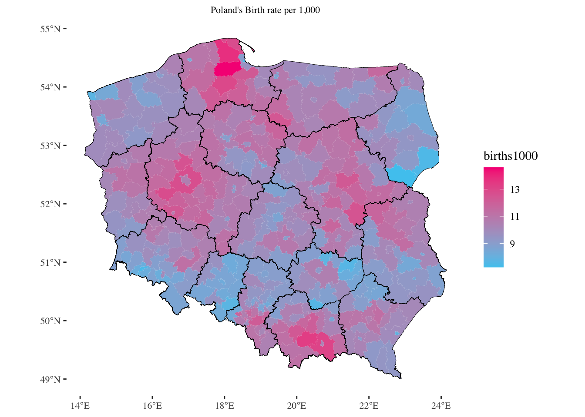
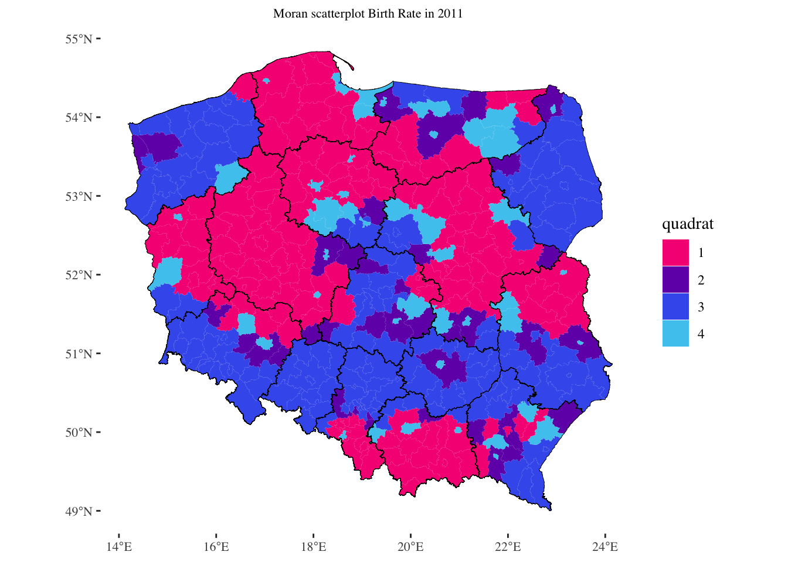
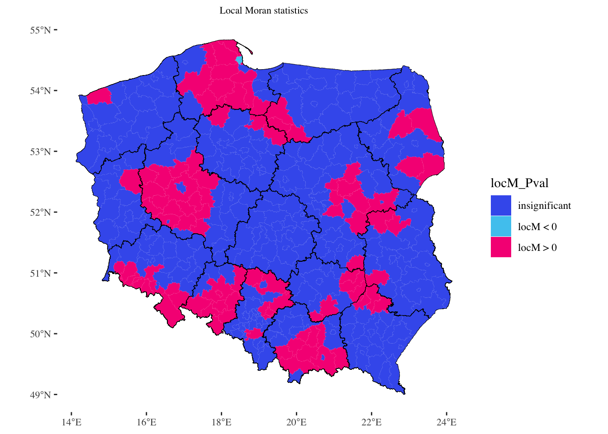

# 2400-ZEWW780-Spatial-Econometrics-in-R

by Zimin Luo & [Maria Kubara](https://github.com/mariak7)

Full report is available at: https://rpubs.com/zi4431/783224

## Background 

In view of the record low fertility rate in Poland in recent years, the Polish government introduced the program “Family 500+” (“Rodzina 500+”) which aims to boost the birth rate by providing tax-benefit aids. The program has cost the government over 31.2 billion PLN one year after its launch11 Ministry of Family and Social Policy, Poland. This project deals with the problem of fertility in Poland, specifically what drives the birth rate. In this study, both linear and spatial econometric models were constructed to test the impact of socio-economic factors on the fertility rate at the county (poviat) level. The results may be a clue for building alternative pro-family policies which are not based on subsidies and are much cost-effective than programs such as 500+.

## OLS model 

Based on Becker’s fertility theory, the following linear model is proposed: 

```
OLS <- lm(births1000 ~ marriages + degree1000 + dependent100 + altruism +
                       unemployMen + salary + women2049, data = data)
```

Where:

- _marriages_ - number of marriages in a given poviat; it is an indicator that gives a good approximation of the number of households in Poland.
- _degree_ - number of women with higher education degree in a given poviat. Due to the lack of influence of the variables of secondary and occupational education of the mother, this is the only variable that can reflect the theoretical relationship - fertility decreases as women's education increases.
- _dependent_ - number of women being financially reliant on another family member in a given poviat; it is a variable that approximates the number of women who suffer low opportunity cost of having a child; being dependent on another family member, they do not give up their careers to raise their offspring.
- _altruism_ - average number of people in a one household in 2011 in a given poviat; it is the measure that allows local trends in family size to be taken into account. It is also the variable that best approximates the measure of the "altruism" of parents, that is, their natural inclination to create a family of a size similar to the family of their parents, neighbors and loved ones.
- _unemployMen_ - value of registered unemployment rate for men in a given poviat. This indicator is designed to capture the impact of father's lack of stable income on the number of offspring (variable analyzed due to lack of data on male income, but based on the same theoretical relationship - father's income and fertility)
- _salary_ - mean level of monthly income in a given poviat. Although the gender-specific data is not available, this measure should give a good indication of the relationship between fertility and family income.
- _women2049_ - number of women in a production age (20-49 years old) in a given poviat.

The estimators are proven to be statistically significant, however, Global Moran’s I test indicates that the linear model suffers from spatial autocorrelation. 


## Visualization
Figure 1. Birth rate in Poland per 1,000.


Figure 2. Strong positive spatial autocorrelation observed. Poviats are located mainly in the first and third quadrant, meaning that both the birth rate in the given poviat and the average birth rate in the nerghbouring poviats are either higher (in the 1st quadrant) or lower (in the third quadrant) than the overall average



Figure 3. Local hot spots identified by the Local Moran Statistics 



## Spatial Models 

The following spatial models (and their variants) are compared: 

- The Manski Model (GNS) 
- Spatial Lag Model
- Spatial Error Model 
- Spatial Durbin Model 
- Spatial Durbin Error Model

## Findings:

- fertility is negatively related to the mean income in the poviat and the unemployment rate of men;
- fertility is positively related to women’s economic situation: the more women that have either received higher education or are financially dependent in a poviat, the higher the birth rate.
- fertility is strongly influenced by their worldview: procreation decisions will tend to be close to the commonly accepted family model


